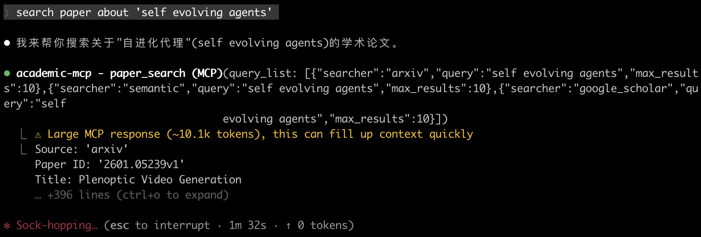

# 📚 Academic MCP

[English](README.md) | [中文](README_zh.md)

🔬 `academic-mcp` 是一个基于 Python 的 MCP 服务器，使用户能够从各种平台搜索、下载和阅读学术论文。它提供三个主要工具：
- 🔎 **`paper_search`**：跨多个学术数据库搜索论文
- 📥 **`paper_download`**：下载论文 PDF，返回下载文件的路径
- 📖 **`paper_read`**：提取和阅读论文的文本内容

  

---

## 📑 目录

- [🎬 演示](#-演示)
- [📝 待办事项](#-待办事项)
- [✨ 特性](#-特性)
- [📦 安装](#-安装)
  - [⚡ 快速开始](#-快速开始)
  - [🛠️ 开发环境](#️-开发环境)
- [🚀 使用](#-使用)
  - [🔎 搜索论文](#1-搜索论文-paper_search)
  - [📥 下载论文](#2-下载论文-paper_download)
  - [📖 阅读论文](#3-阅读论文-paper_read)
  - [⚙️ 环境变量](#️-环境变量)
- [🤝 贡献](#-贡献)
- [📄 许可证](#-许可证)

---

## ✨ 特性

- 🌐 **多源支持**：从 arXiv、PubMed、bioRxiv、medRxiv、Google Scholar、IACR ePrint Archive、Semantic Scholar 和 CrossRef 搜索和下载论文。
- 🎯 **统一接口**：通过一致的 `paper_search`、`paper_download` 和 `paper_read` 工具访问所有平台。
- 📊 **标准化输出**：通过 `Paper` 类以一致的字典格式返回论文。
- ⚡ **异步操作**：使用 `httpx` 和 async/await 高效处理并发搜索和下载。
- 🔌 **MCP 集成**：与 MCP 客户端兼容，用于增强 LLM 上下文。
- 🧩 **可扩展设计**：通过扩展 `sources` 模块轻松添加新的学术平台。

## 🎬 演示



## 📝 待办事项

计划支持的学术平台

- [x] arXiv
- [x] PubMed
- [x] bioRxiv
- [x] medRxiv
- [x] Google Scholar
- [x] IACR ePrint Archive
- [x] Semantic Scholar
- [x] CrossRef
- [ ] PubMed Central (PMC)
- [ ] Science Direct
- [ ] Springer Link
- [ ] IEEE Xplore
- [ ] ACM Digital Library
- [ ] Web of Science
- [ ] Scopus
- [ ] JSTOR
- [ ] ResearchGate
- [ ] CORE
- [ ] Microsoft Academic

## 📦 安装

`academic-mcp` 可以使用 `uv` 或 `pip` 安装。以下是针对不同场景的详细安装指南。

### ⚡ 快速安装

安装软件包：

```bash
pip install academic-mcp
```

或使用 uv（推荐，安装更快）：

```bash
uv pip install academic-mcp
```

### 🔧 MCP 客户端配置

选择您使用的 MCP 客户端并按照配置步骤操作：

<details>
<summary><b>1️⃣ Claude Desktop（桌面应用）</b></summary>

**配置文件位置：**
- macOS: `~/Library/Application Support/Claude/claude_desktop_config.json`
- Windows: `%APPDATA%\Claude\claude_desktop_config.json`

**配置内容：**
```json
{
  "mcpServers": {
    "academic-mcp": {
      "command": "python",
      "args": ["-m", "academic_mcp"],
      "env": {
        "SEMANTIC_SCHOLAR_API_KEY": "",
        "ACADEMIC_MCP_DOWNLOAD_PATH": "./downloads"
      }
    }
  }
}
```

**使用 uvx（替代方案）：**
```json
{
  "mcpServers": {
    "academic-mcp": {
      "command": "uvx",
      "args": ["academic-mcp"],
      "env": {
        "SEMANTIC_SCHOLAR_API_KEY": "",
        "ACADEMIC_MCP_DOWNLOAD_PATH": "./downloads"
      }
    }
  }
}
```

</details>

<details>
<summary><b>2️⃣ Claude Code（命令行工具）</b></summary>

**配置文件位置：** `~/.config/claude/config.json`

**配置内容：**
```json
{
  "mcpServers": {
    "academic-mcp": {
      "command": "python",
      "args": ["-m", "academic_mcp"],
      "env": {
        "SEMANTIC_SCHOLAR_API_KEY": "",
        "ACADEMIC_MCP_DOWNLOAD_PATH": "./downloads"
      }
    }
  }
}
```

**验证安装：**
```bash
# 检查 academic-mcp 是否已加载
claude mcp list

# 测试服务器
claude mcp test academic-mcp
```

</details>

<details>
<summary><b>3️⃣ Cline（VS Code 扩展）</b></summary>

**配置位置：** VS Code 设置 → 扩展 → Cline → MCP 设置

**方法 1：通过 VS Code 设置界面**
1. 打开 VS Code 设置（Cmd/Ctrl + ,）
2. 搜索 "Cline MCP"
3. 点击 "在 settings.json 中编辑"
4. 添加配置：

```json
{
  "cline.mcpServers": {
    "academic-mcp": {
      "command": "python",
      "args": ["-m", "academic_mcp"],
      "env": {
        "SEMANTIC_SCHOLAR_API_KEY": "",
        "ACADEMIC_MCP_DOWNLOAD_PATH": "./downloads"
      }
    }
  }
}
```

**方法 2：直接编辑 settings.json**

编辑 `~/.config/Code/User/settings.json`（Linux/macOS）或 `%APPDATA%\Code\User\settings.json`（Windows）：

```json
{
  "cline.mcpServers": {
    "academic-mcp": {
      "command": "python",
      "args": ["-m", "academic_mcp"],
      "env": {
        "SEMANTIC_SCHOLAR_API_KEY": "",
        "ACADEMIC_MCP_DOWNLOAD_PATH": "./downloads"
      }
    }
  }
}
```

</details>

<details>
<summary><b>4️⃣ Zed 编辑器</b></summary>

**配置文件位置：** `~/.config/zed/settings.json`

**配置内容：**
```json
{
  "context_servers": {
    "academic-mcp": {
      "command": {
        "path": "python",
        "args": ["-m", "academic_mcp"]
      },
      "settings": {
        "env": {
          "SEMANTIC_SCHOLAR_API_KEY": "",
          "ACADEMIC_MCP_DOWNLOAD_PATH": "./downloads"
        }
      }
    }
  }
}
```

</details>

<details>
<summary><b>5️⃣ 自定义 MCP 客户端</b></summary>

对于其他 MCP 客户端，使用标准的 MCP 服务器配置：

**服务器命令：**
```bash
python -m academic_mcp
```

**环境变量：**
- `SEMANTIC_SCHOLAR_API_KEY`: Semantic Scholar 的可选 API 密钥
- `ACADEMIC_MCP_DOWNLOAD_PATH`: 下载目录（默认：`./downloads`）

**服务器功能：**
- 工具：`paper_search`、`paper_download`、`paper_read`
- 传输方式：stdio
- 协议：MCP 1.0

</details>

### 📝 配置说明

> **API 密钥：**
> - `SEMANTIC_SCHOLAR_API_KEY` 是可选的，仅用于增强 Semantic Scholar 功能
> - 所有其他数据源无需 API 密钥即可工作
>
> **下载路径：**
> - 建议使用绝对路径设置 `ACADEMIC_MCP_DOWNLOAD_PATH` 以避免混淆
> - 确保目录存在，或服务器将自动创建
> - 示例：`/Users/yourusername/Documents/papers` 或 `C:\Users\yourusername\papers`
>
> **Python 环境：**
> - 确保 `python` 命令指向 Python 3.10+
> - 对于虚拟环境，使用完整路径：`/path/to/venv/bin/python`
> - 对于 conda：`/path/to/conda/envs/yourenv/bin/python`

### 🛠️ 开发环境

对于想要修改代码或贡献的开发者：

1. **设置环境**：

   ```bash
   # 如果未安装 uv，请先安装
   curl -LsSf https://astral.sh/uv/install.sh | sh

   # 克隆仓库
   git clone https://github.com/LinXueyuanStdio/academic-mcp.git
   cd academic-mcp

   # 创建并激活虚拟环境
   uv venv
   source .venv/bin/activate  # Windows: .venv\Scripts\activate
   ```

2. **安装依赖**：

   ```bash
   # 安装依赖（推荐）
   uv pip install -e .

   # 添加开发依赖（可选）
   uv pip install pytest flake8
   ```

---

## 🚀 使用

配置完成后，`academic-mcp` 通过 Claude Desktop 或任何兼容 MCP 的客户端提供三个主要工具：

### 1. 搜索论文 (`paper_search`)

跨多个来源搜索学术论文：

```python
# 在 arXiv 上搜索机器学习论文
paper_search([
    {"searcher": "arxiv", "query": "machine learning", "max_results": 5}
])

# 同时搜索多个平台
paper_search([
    {"searcher": "arxiv", "query": "deep learning", "max_results": 5},
    {"searcher": "pubmed", "query": "cancer immunotherapy", "max_results": 3},
    {"searcher": "semantic", "query": "climate change", "max_results": 4, "year": "2020-2023"}
])

# 搜索所有平台（省略 "searcher" 参数）
paper_search([
    {"query": "quantum computing", "max_results": 10}
])
```

### 2. 下载论文 (`paper_download`)

使用标识符下载论文 PDF：

```python
paper_download([
    {"searcher": "arxiv", "paper_id": "2106.12345"},
    {"searcher": "pubmed", "paper_id": "32790614"},
    {"searcher": "biorxiv", "paper_id": "10.1101/2020.01.01.123456"},
    {"searcher": "semantic", "paper_id": "DOI:10.18653/v1/N18-3011"}
])
```

### 3. 阅读论文 (`paper_read`)

提取和阅读论文的文本内容：

```python
# 阅读 arXiv 论文
paper_read(searcher="arxiv", paper_id="2106.12345")

# 阅读 PubMed 论文
paper_read(searcher="pubmed", paper_id="32790614")

# 阅读 Semantic Scholar 论文
paper_read(searcher="semantic", paper_id="DOI:10.18653/v1/N18-3011")
```

### ⚙️ 环境变量

- `SEMANTIC_SCHOLAR_API_KEY`：用于增强 Semantic Scholar 功能的可选 API 密钥
- `ACADEMIC_MCP_DOWNLOAD_PATH`：下载 PDF 的目录（默认：`./downloads`）

---

## 🤝 贡献

我们欢迎贡献！以下是入门指南：

1. **Fork 仓库**：
   在 GitHub 上点击"Fork"。

2. **克隆并设置**：

   ```bash
   git clone https://github.com/yourusername/academic-mcp.git
   cd academic-mcp
   uv pip install -e .  # 以开发模式安装
   ```

3. **进行更改**：

   - 在 `academic_mcp/sources/` 中添加新平台。
   - 在 `tests/` 中更新测试。

4. **提交 Pull Request**：
   推送更改并在 GitHub 上创建 PR。

## 📄 许可证

本项目采用 MIT 许可证。详情请参阅 LICENSE 文件。

---

祝您使用 `academic-mcp` 研究愉快！如果遇到问题，请在 GitHub 上提交 issue。
